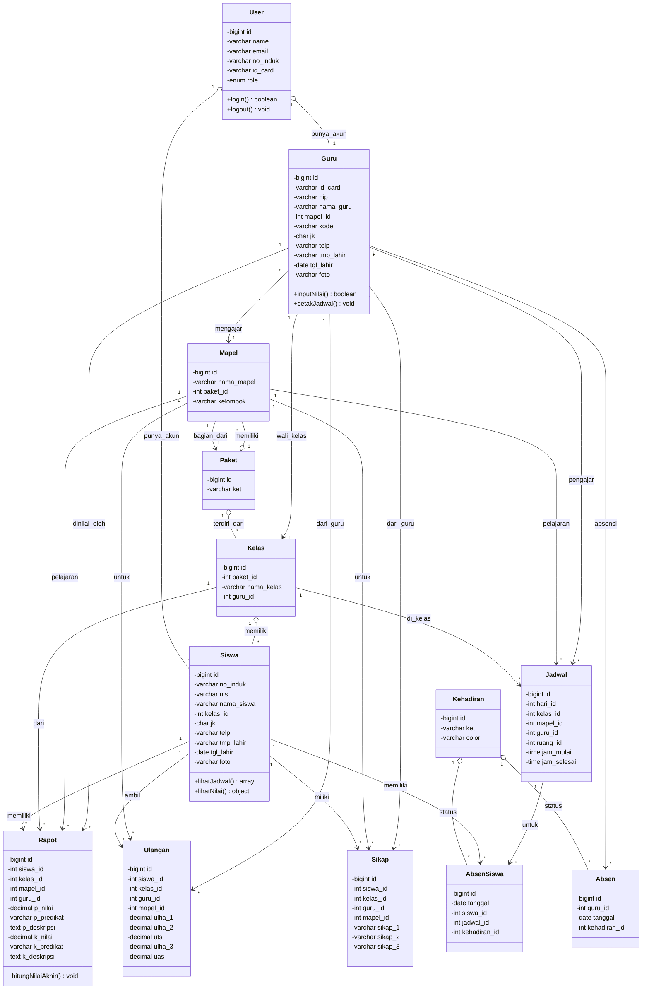

# Class Diagram - Sistem Informasi Akademik Sekolah

Diagram kelas untuk sistem akademik sekolah yang terintegrasi meliputi manajemen pengguna, kelas, guru, siswa, jadwal, dan penilaian.

> **Catatan:** Class diagram lengkap tersimpan dalam format PlantUML di `class_diagram.puml` untuk visualisasi ERD yang lebih detail.

## Diagram Mermaid (Simplified)

## Entitas dan Atribut Utama

### User (Pengguna/Akun)

- **id**: Identitas unik pengguna
- **name**: Nama lengkap
- **email**: Alamat email
- **no_induk**: Nomor induk (siswa/guru)
- **id_card**: Nomor identitas (KTP/SIM)
- **role**: Peran (siswa, guru, admin)

### Siswa

- **no_induk**: Nomor Induk Siswa
- **nis**: Nomor Induk Sekolah
- **nama_siswa**: Nama lengkap siswa
- **kelas_id**: Referensi ke Kelas
- **jk**: Jenis kelamin
- **telp, tmp_lahir, tgl_lahir**: Data pribadi
- **foto**: Foto profil

### Guru

- **id_card**: Nomor identitas
- **nip**: Nomor Induk Pegawai
- **nama_guru**: Nama lengkap guru
- **mapel_id**: Mata pelajaran yang diajar
- **kode**: Kode guru unik
- **jk, telp, tmp_lahir, tgl_lahir**: Data pribadi

### Kelas

- **nama_kelas**: Nama/identitas kelas
- **paket_id**: Program/paket kelas
- **guru_id**: Wali kelas

### Jadwal

- **hari_id**: Hari dalam seminggu
- **jam_mulai, jam_selesai**: Waktu pelajaran
- **kelas_id, mapel_id, guru_id, ruang_id**: Referensi

### Rapot (Laporan Hasil Belajar)

- **p_nilai, k_nilai**: Nilai pengetahuan dan keterampilan
- **p_predikat, k_predikat**: Predikat/grade
- **p_deskripsi, k_deskripsi**: Deskripsi hasil belajar

### Ulangan (Penilaian Berkala)

- **ulha_1, ulha_2, ulha_3**: Ulangan harian
- **uts**: Ujian tengah semester
- **uas**: Ujian akhir semester

### Sikap (Penilaian Karakter)

- **sikap_1, sikap_2, sikap_3**: Tiga aspek penilaian sikap

### Kehadiran (Jenis Kehadiran)

- **id**: Identitas jenis kehadiran
- **ket**: Keterangan status kehadiran (Hadir, Sakit, Izin, Alfa, dll)
- **color**: Warna untuk keperluan UI/tampilan

### Absen (Absensi Guru)

- **guru_id**: Referensi ke guru
- **tanggal**: Tanggal absensi
- **kehadiran_id**: Jenis kehadiran (Hadir/Tidak Hadir/dll)

### AbsenSiswa (Absensi Siswa)

- **tanggal**: Tanggal absensi siswa
- **siswa_id**: Referensi ke siswa
- **jadwal_id**: Referensi ke jadwal pelajaran
- **kehadiran_id**: Jenis kehadiran siswa

## Relasi Antar Entitas

### Relasi Inti

- **User ↔ Siswa/Guru**: User adalah akun yang terkait dengan Siswa atau Guru
- **Paket → Kelas/Mapel**: Paket mengelompokkan kelas dan mata pelajaran
- **Guru → Kelas**: Guru dapat menjadi wali kelas
- **Guru → Mapel**: Guru mengajar satu mata pelajaran

### Relasi Jadwal

- **Kelas, Mapel, Guru → Jadwal**: Jadwal menghubungkan kelas, mata pelajaran, dan guru dalam waktu tertentu

### Relasi Penilaian

- **Siswa → Rapot/Ulangan/Sikap**: Siswa memiliki berbagai penilaian
- **Guru → Penilaian**: Guru menginput nilai
- **Mapel → Penilaian**: Setiap penilaian terkait dengan mata pelajaran tertentu

### Relasi Kehadiran

- **Kehadiran (1) → (\*) Absen**: Satu jenis kehadiran dapat memiliki banyak catatan absensi
- **Guru (1) → (\*) Absen**: Satu guru dapat memiliki banyak catatan absensi
