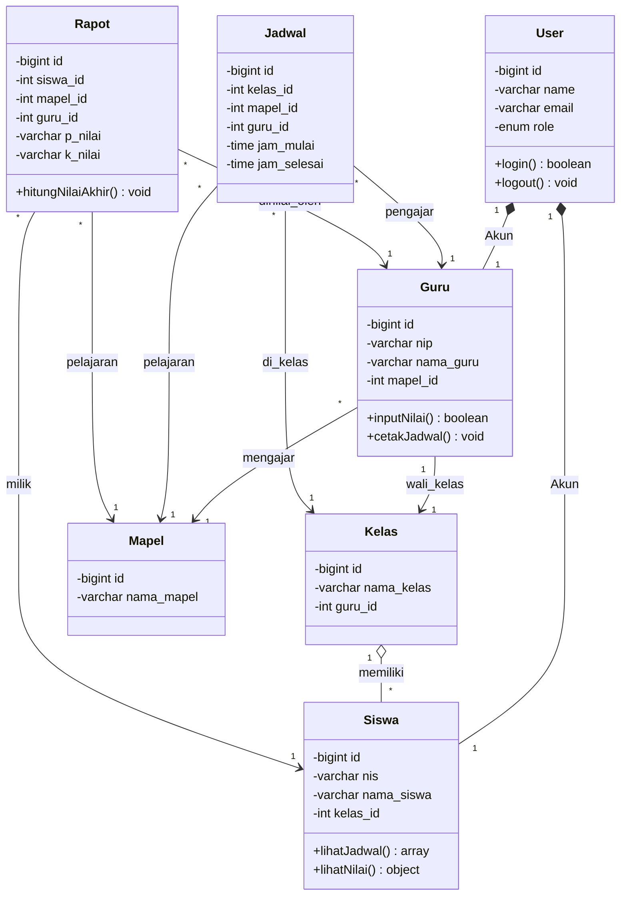

# ERD / Class Diagram - Sistem Informasi Akademik Sekolah (Simplified)

Berikut adalah UML Class Diagram yang telah **disederhanakan**. Diagram ini hanya menampilkan 7 entitas paling krusial dalam sistem akademik Anda (menghilangkan tabel referensi kecil seperti Hari, Ruang, Kehadiran, dll) beserta atribut utamanya agar jauh lebih mudah dibaca dan dipahami relasinya.

